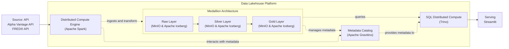

# Argos Finance Data Platform

> An end-to-end ETL pipeline that ingests daily trades and FED interest rates data, transforms it with PySpark, and serves a Streamlit web application dashboard.

<!-- Optional badges: build status, license, tools. Recruiters like the polish. -->

[](https://github.com/marcellinus-witarsah/argos-finance-data-platform/actions/workflows/data-pipeline-test.yml)


---

## Overview

**The problem.** <What real-world / business problem does this solve? 2-4 sentences. Frame the "why," not the tech.>

**The approach.** <How you solved it, at a high level. What tradeoff you optimized for — cost, reliability, latency, or scale.>

**Impact / scale.** <Quantify. Reviewers reward numbers over pipelines.>
- Processes ~<N> rows / <N> GB per run
- Runs <hourly / daily / on event>
- <e.g. "Replaced a manual 4-hour reporting process" or "Cut compute cost ~30%">

---

## Architecture
Data Lakehouse Architecture accounts for flexibility storing both structure and unstructured data while still maintaining data governance.
The Data Lakehouse itself consists of:
- MinIO: Data lake for storing all kinds of data.
- Apache Gravtition: Data catalog for navigating through the data inside data lake.
- Iceberg: Open table format for enabling files to be treated as a table.
- Spark: Distributed compute engine for general data processing.
- Trino: Distributed query engine for quering data in efficiently.

Data design pattern that is used is Medallion Architecture that organizes data into three stages:
- Bronze: landing zone for source system data as is.
- Silver: standardized and cleaned data.
- Gold: aggregated, join, or denormalized according to dashboard needs.



**Data flow:** 
1. Data comes from API: Alpha Vantage API for daily trades data and FRED® API for the FED interest rates data. Then, it is stored in JSON string format inside Bronze Layer
2. From Bronze Layer, data will be transformed and standardized, then later is stored inside Silver Layer.
3. From Silver Layer, data will be joined and denormalized before it is stored inside Gold Layer.
4. From Gold Layer, data will be queried using Trino and displayed inside a Streamlit Web Application Dashboard. 

---

## Tech Stack

<!-- A table is fast to skim. Only list what you actually used. -->

| Layer                          | Tools                      |
|--------------------------------|----------------------------|
| Ingestion                      | Apache Spark               |
| Storage                        | MinIO                      |
| Data Catalog                   | Apache Gravitino           |
| Metadata Storage               | PostgreSQL                 |
| Dsitributed Compute Engine     | Apache Spark               |
| Distributed SQL Compute        | Trino                      |
| Orchestration                  | _Not Yet Implemented_      |
| Data Quality                   | _Not Yet Implemented_      |
| Serving / BI                   | Streamlit                  |
| Infra / DevOps                 | Docker, GitHub Actions     |
| Testing                        | pytest                     |

---

## Features

- <Key capability 1 — tie to an outcome, not just a feature>
- <e.g. Incremental loads with idempotent, re-runnable tasks>
- <e.g. Automated data-quality checks that fail the pipeline on bad data>
- <e.g. Alerting / logging / monitoring>
- <e.g. Fully containerized — runs locally with one command>

---

## Testing
The pipelines were developed using Test Driven Approach. The test suite covers:
- Integration Testing
  - ETL data pipelines (table writing validation, schema validation, ETL output validation).
- Unit Testing
  - API GET function.
  - PySpark table extraction logic.
  - PySpark table transformation logic.
  - PySpark table writing logic.
  - Other custom functions.

Run tests: 
```bash
pytest tests/
```
Coverage:
```bash
pytest --cov=src tests/
```
---

## Getting Started

### Prerequisites
- <Docker & Docker Compose / Python 3.11 / cloud account, etc.>

### Setup
```bash
# 1. Clone
git clone [https://github.com/<user>/<repo>.git](https://github.com/marcellinus-witarsah/argos-finance-data-platform.git)
cd argos-finance-data-platform

# 2. Configure environment
cp .env.example .env      # then fill in credentials

# 3. Spin up the data lakehouse infrastructures
docker compose up -d

# 4. Run the pipeline
<To be Filled>
```

### Sample output
<!-- For pipelines with no live service, show proof it works: a sample output file, a screenshot of the DAG, or a log snippet. -->
<e.g. "See `docs/sample_output.csv`" or paste a short run log.>

---

## Screenshots / Demo

<!-- Visual proof carries weight. Add a dashboard screenshot, a DAG graph, or a GIF. Include a live link if hosted. -->


---

## Project Structure

```
argos-finance-data-platform/
├── configs            # Configurations for pipeline runs
├── infrastructures    # Data lakehouse infrastructures
├── pipelines          # Data pipelines for bronze, silver, and gold layer
├── scripts            # Shell scripts for infrastructure set up
├── src                # Reausable class and function for supporting data pipelines
├── tests              # Unit testing & integration testing
├── app.py             # Streamlit web script
├── docker-compose.yaml     
├── README.md
└── requirements.txt

```

---

## Results & Learnings

- **Results:** <metrics, performance numbers, what the output looks like>
- **What I learned:** <a design decision or tradeoff — signals engineering maturity>
- **What I'd improve next:** <shows self-awareness; good interview fodder>

<!-- Optional: "Update 2026: migrated to Delta Lake for reliability" — signals continuous learning. -->

---

## License & Contact

Licensed under the MIT License — see [LICENSE](LICENSE).

**<Your Name>** · [LinkedIn](<url>) · [Portfolio](<url>) · <email>
