# Argos Finance Data Platform

> An end-to-end ETL pipeline that ingests daily trades and Fed interest rate data, transforms it with PySpark, and serves a Streamlit web application dashboard.

<!-- Optional badges: build status, license, tools. Recruiters like the polish. -->

[](https://github.com/marcellinus-witarsah/argos-finance-data-platform/actions/workflows/data-pipeline-test.yml)


---

## Overview

The idea behind this project is pretty simple: pull in crypto price data and FED interest rate data, run it through a proper pipeline, and land it on a dashboard where a trader or investor can see price action next to the macro picture without juggling five different tabs. Rates move markets, so having both in one place instead of eyeballing them separately felt like a small but real win.

To be honest, there are other dashboards and tools that already do this. This isn't me trying to out-build them — I wanted to build, and learn more in depth, how end-to-end data solutions are put together using a tech stack I'm familiar with.

I built a data lakehouse myself, with medallion architecture, Iceberg tables, Spark for compute, and Trino for querying, rather than just reading about how it's supposed to work. So this is as much a "let me learn this stack for real" project as it is a finance tool.

---

## Architecture
Data Lakehouse Architecture allows flexibility in storing both structured and unstructured data while still maintaining data governance.
The Data Lakehouse itself consists of:
- MinIO: Data lake for storing all kinds of data.
- Apache Gravitino: Data catalog for navigating through the data inside the data lake.
- Iceberg: Open table format for enabling files to be treated as a table.
- Spark: Distributed compute engine for general data processing.
- Trino: Distributed query engine for querying data efficiently.

The data design pattern used is Medallion Architecture, which organizes data into three stages:
- Bronze: landing zone for source system data as is.
- Silver: standardized and cleaned data.
- Gold: aggregated, joined, or denormalized according to dashboard needs.

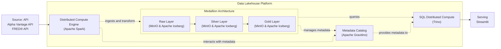

**Data flow:**
1. Data comes from an API: Alpha Vantage API for daily trades data and FRED® API for Fed interest rate data. It is then stored in JSON string format inside the Bronze Layer.
2. From the Bronze Layer, data is transformed and standardized, then stored in the Silver Layer.
3. From the Silver Layer, data is joined and denormalized before being stored in the Gold Layer.
4. From the Gold Layer, data is queried using Trino and displayed in the Streamlit web application dashboard.

---

## Tech Stack

<!-- A table is fast to skim. Only list what you actually used. -->

| Layer                          | Tools                      |
|--------------------------------|----------------------------|
| Ingestion                      | Apache Spark               |
| Storage                        | MinIO                      |
| Data Catalog                   | Apache Gravitino           |
| Metadata Storage               | PostgreSQL                 |
| Distributed Compute Engine     | Apache Spark               |
| Distributed SQL Compute        | Trino                      |
| Orchestration                  | _Not Yet Implemented_      |
| Data Quality                   | _Not Yet Implemented_      |
| Serving / BI                   | Streamlit                  |
| Infra / DevOps                 | Docker, GitHub Actions     |
| Testing                        | Pytest                     |

---

## Features

- <Key capability 1 — tie to an outcome, not just a feature>
- <e.g. Incremental loads with idempotent, re-runnable tasks>
- <e.g. Automated data-quality checks that fail the pipeline on bad data>
- <e.g. Alerting / logging / monitoring>
- <e.g. Fully containerized — runs locally with one command>

---

## Testing
The pipelines were developed using a Test-Driven Approach. The test suite covers:
- Integration Testing
  - ETL data pipelines (table writing validation, schema validation, ETL output validation).
- Unit Testing
  - API GET function.
  - PySpark table extraction logic.
  - PySpark table transformation logic.
  - PySpark table writing logic.
  - Other custom functions.

Run tests:
```bash
pytest tests/
```
Coverage:
```bash
pytest --cov=src tests/
```
---

## Getting Started

### Prerequisites
- Docker
- Python 3.10.11

### Setup
```bash
# 1. Clone
git clone [https://github.com/<user>/<repo>.git](https://github.com/marcellinus-witarsah/argos-finance-data-platform.git)
cd argos-finance-data-platform

# 2. Configure environment
cp .env.example .env      # then fill in credentials (API keys)

# 3. Spin up the data lakehouse infrastructures
docker compose up -d

# 4. Go inside the Master/Driver node
docker exec -it spark-master bash

# 5. Run the pipeline (Run these one by one)
# API to bronze layer
python pipelines/api2bronze/alpha_vantage_crypto_ohlcv/pipeline.py --symbol BTC --market USD
python pipelines/api2bronze/fed_interest_rates/pipeline.py
# Bronze to silver layer
python pipelines/bronze2silver/crypto_ohclv/pipeline.py
python pipelines/bronze2silver/interest_rates/pipeline.py
# Silver to gold layer
python pipelines/silver2gold/bitcoin_ohlcv_vs_fed_interest_rates/pipeline.py

```

### Sample output
<!-- For pipelines with no live service, show proof it works: a sample output file, a screenshot of the DAG, or a log snippet. -->
<e.g. "See `docs/sample_output.csv`" or paste a short run log.>
## api2bronze-alpha_vantage_crypto_ohlcv_pipeline
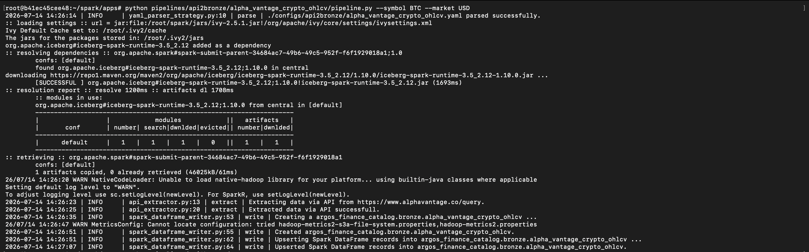
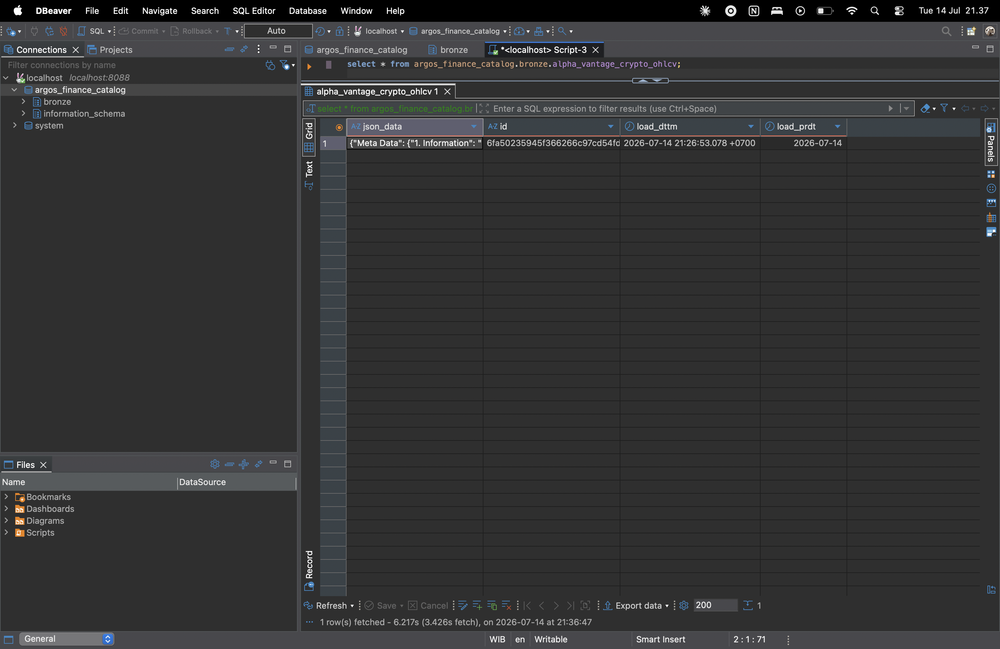

## api2bronze-fed_interest_rates_pipeline
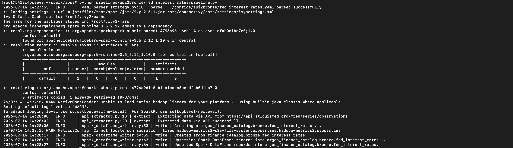
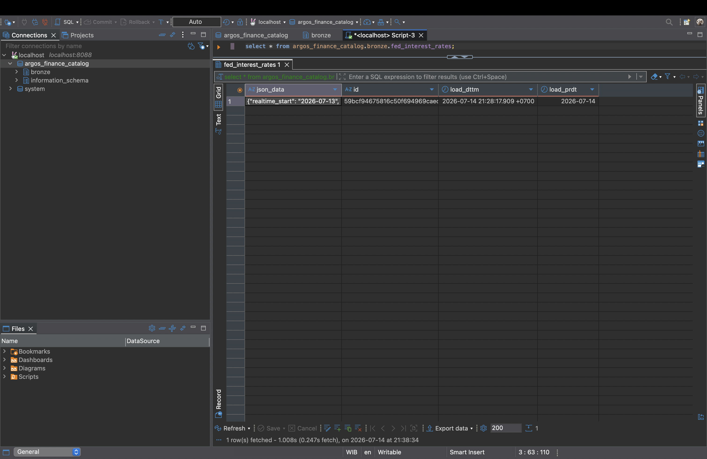

## bronze2silver-crypto_ohlcv_pipeline
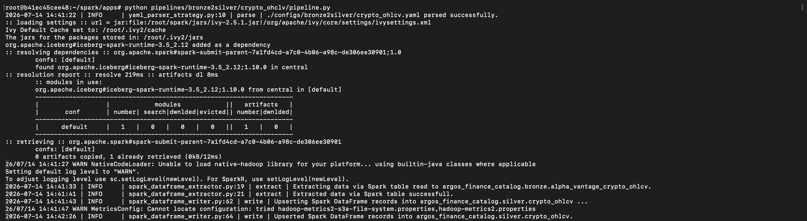
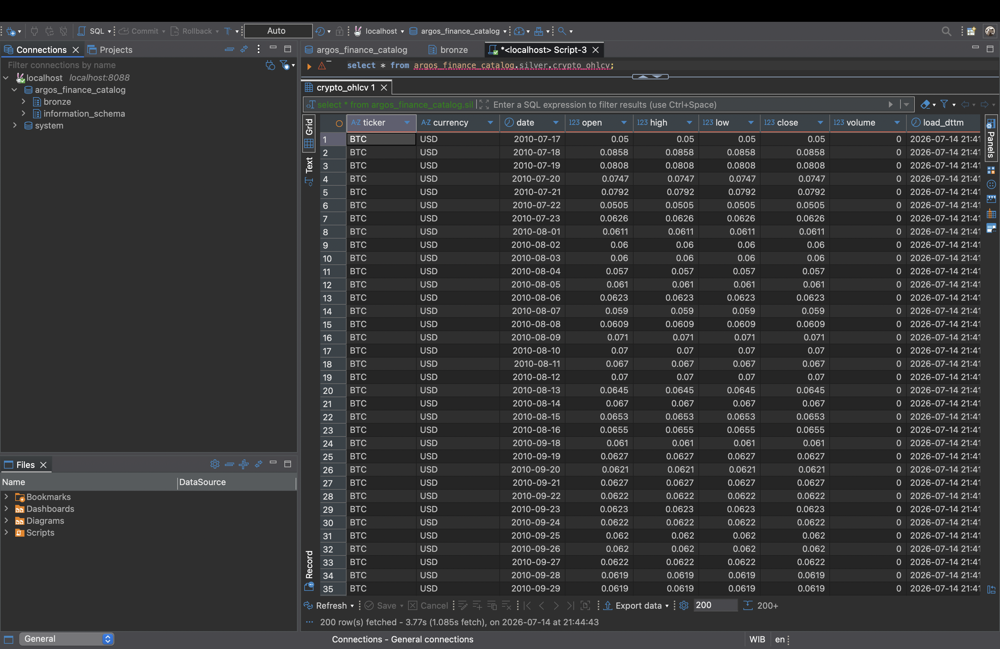

## bronze2silver-interest_rates_pipeline
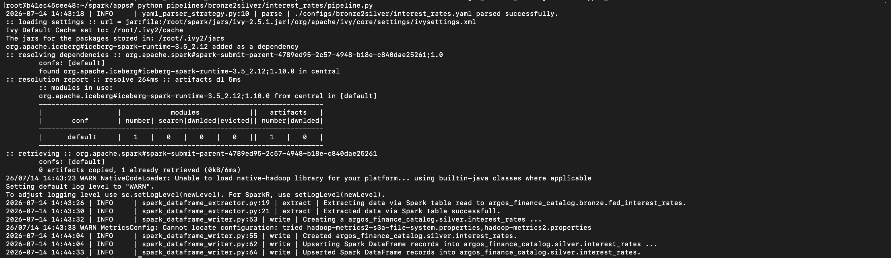
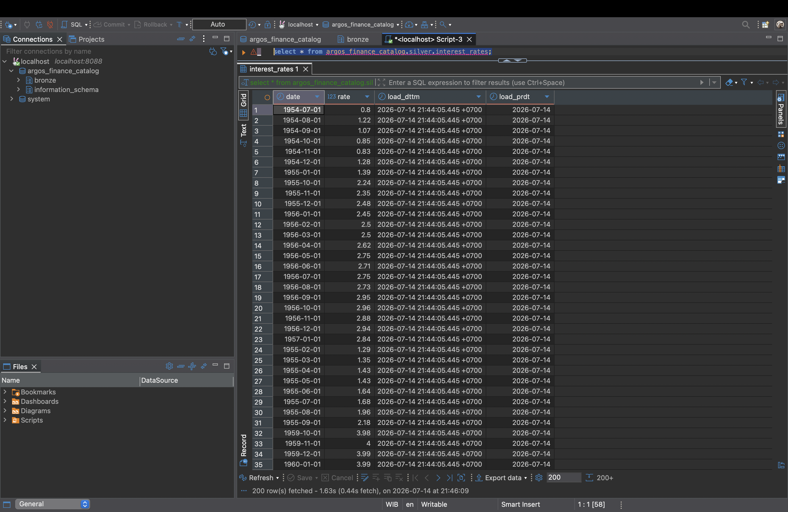

## silver2gold-bitcoin_ohlcv_vs_fed_interest_rates_pipeline
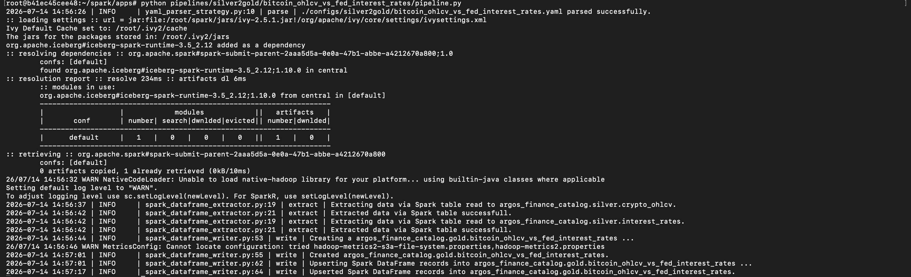
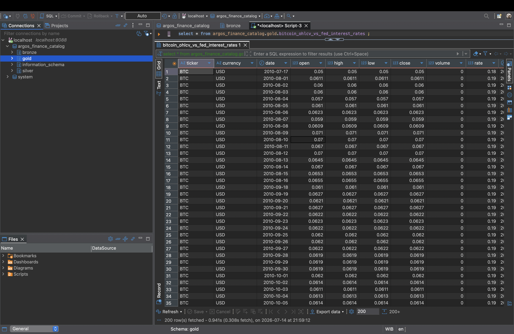

---

## Screenshots / Demo

<!-- Visual proof carries weight. Add a dashboard screenshot, a DAG graph, or a GIF. Include a live link if hosted. -->
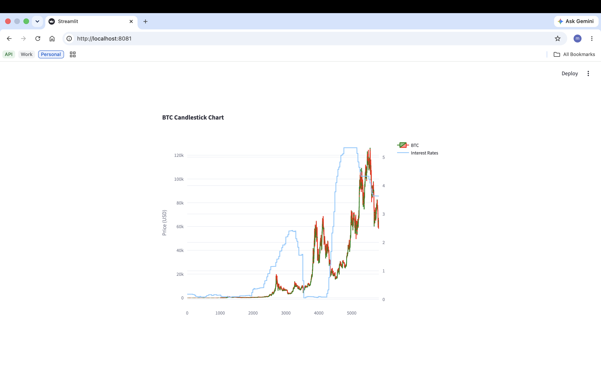

---

## Project Structure

```
argos-finance-data-platform/
├── configs            # Configurations for pipeline runs
├── infrastructures    # Data lakehouse infrastructures
├── pipelines          # Data pipelines for bronze, silver, and gold layers
├── scripts            # Shell scripts for infrastructure setup
├── src                # Reusable classes and functions for supporting data pipelines
├── tests              # Unit testing & integration testing
├── env.example        # Example environment variables
├── app.py             # Streamlit web script
├── docker-compose.yaml     
├── README.md
└── requirements.txt

```

---

## Results & Learnings

- **Results:** A single web application dashboard that displays Bitcoin OHLCV data alongside Fed interest rates.
- **What I learned:**
  - Each component needed to run a **Data Lakehouse**.
  - How **Medallion Architecture** works — how the bronze, silver, and gold layers fit together.
  - How to implement Test-Driven Development (**unit** and **integration testing**) for building data pipelines and other functions.
- **What I'd improve next:**
  - Add more macro financial data, like Money Supply (M2), Gross Domestic Product (GDP), Consumer Price Index (CPI), etc.
  - Add an orchestrator for scheduling data pipelines and running them in a specific order. One example would be Apache Airflow.
  - Implement data quality scoring on all incoming data across the bronze, silver, and gold layers.

<!-- Optional: "Update 2026: migrated to Delta Lake for reliability" — signals continuous learning. -->
